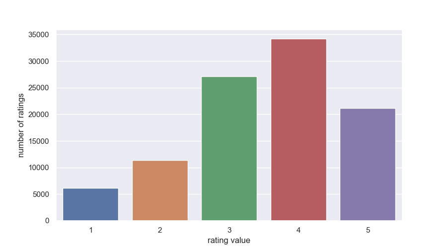

# Introduction
Assignment task involves crafting a movie recommender system tailored to users’ preferences. The movie recommendation 
problem revolves around providing personalized suggestions to users by analyzing various facets of movies and users 
themselves. These systems not only enhance user experience by offering tailored suggestions but also assist platforms 
in increasing user engagement and retention. Techniques such as collaborative filtering, content-based filtering, 
matrix factorization, and deep learning are commonly employed to generate accurate and relevant recommendations.

The fusion of LightGCN's graph-based collaborative filtering with feature-enhanced embeddings showcases a [promising
approach](https://papers.ssrn.com/sol3/papers.cfm?abstract_id=4257664) toward addressing the challenges inherent in 
movie recommendation systems. Hence, I endeavored to execute this strategy in practice.
# Data analysis
For this assignment [MovieLens 100K dataset](https://grouplens.org/datasets/movielens/100k/) was provided. In order to
build a solution it is crucial to understand the structure and properties of the given data. The whole process of data
exploration can be found in the [corresponding notebook](../notebooks/1.0-initial-data-exporation.ipynb). In this 
section I will just summarize obtained results.

## Validation of the structure
I validated that the structure of the provided files aligns with the descriptions outlined in the accompanying
README.txt. The structure was found to be accurate and consistent. 

## Examination of the data for any absent values 
* The 'video release date' information is absent for each film.
* The 'release date' is absent for the movie identified as ID 267 ('unknown').
* The 'IMDb URL' is absent for movies with IDs 267 ('unknown'), 1358 ('The Deadly Cure (1996)'), and 1359 ('Boys in Venice (1996)').

All other data entries are complete.

## Data distributions
### Ratings distribution

Notes: The count of ratings marked as '1' and '2' appears to be relatively low.
### Movie data distribution
#### Release years distribution

Notes: The majority of the movies fall within the range of 1990 to 1997.
#### Genres distribution

Notes: The most favored genres include action, comedy, drama, romance, and thriller.
### User data distribution
#### Ages distribution

Notes: Many users fall within the age range of 20 to 35.
#### Genders distribution

Notes: There is over twice the number of men compared to women.
#### Occupations distribution

Notes: The breakdown of users' occupations suggests a substantial presence of students within the user demographic.

## Conclusion
The absent data won't impact my solution as I don't intend to utilize these movie features. I focused on utilizing the 
features demonstrated in [Data distributions](#data-distributions).  I opted against utilizing 
['Release years'](#release-years-distribution) and ['Ages'](#ages-distribution) due to sparse data in those categories, 
in my judgment.

# [Model Implementation](../notebooks/2_0_LightGCN_based_recommendation_system.ipynb)
## Implementation Details

### RecSysGNN Model

The `RecSysGNN` class serves as the core model for the recommender system using Graph Neural Networks (GNNs). It initializes the necessary components for embedding users and items, employing message passing through LGConv layers for feature aggregation.

- **Embedding Layers:**
  - `nn.Embedding(num_users + num_items, latent_dim)`: Initializes an embedding layer for users and items. It creates embeddings of a specified `latent_dim` dimensionality for the combined total number of users and items.
  - `nn.Linear(feat_dim, latent_dim)`: Creates embeddings for additional features, such as demographic or user-specific data, projecting them into the same `latent_dim` space as the user and item embeddings.

- **LGConv Layers:**
  - `self.convs`: Initializes a list of `num_layers` LGConv layers. These layers facilitate message passing through the graph structure, enabling information exchange between connected nodes.

### Forward Pass
The `forward` method defines the flow of information through the model during a forward pass.
- It retrieves the initial embeddings for users and items from the embedding layer.
- Utilizes the `feat_embedding` layer to obtain embeddings for additional features, like demographic information, and integrates them with the initial node embeddings.
- Conducts message passing through LGConv layers (`self.convs`) to aggregate information across the graph.
- Finally, it aggregates the node embeddings to generate the final output.

### Encoding Minibatch
The `encode_minibatch` function encodes a minibatch of users, positive items, and negative items.
- It utilizes the `forward` method to obtain embeddings for users, positive items, and negative items based on the provided indices and graph information.

### Initialization and Parameter Setting
- `init_parameters`: Initializes the model's parameters, specifically setting the initial weights of the embedding layer using a normal distribution (`nn.init.normal_`).

Overall, this implementation leverages LGConv layers for message passing in a graph structure, combines user, item, and additional feature embeddings, and aggregates information to produce embeddings that represent users and items for recommendation.

# Model Advantages and Disadvantages
## Advantages:

1. **Graph Representation Learning:** Utilizes Graph Neural Networks (GNNs) for collaborative filtering, capturing complex relationships among users, items, and additional features within the graph structure.
   
2. **Flexibility in Embedding Generation:** Incorporates additional features (demographic information, user preferences) into the embedding space, enabling a richer representation of users and items.

3. **Message Passing with LGConv Layers:** LGConv layers facilitate effective message passing through the graph, allowing for information aggregation and refinement across multiple layers.

4. **Scalability:** GNNs typically handle large-scale datasets efficiently, making it feasible for scalability in recommending items to a vast number of users.

## Disadvantages:

1. **Cold Start Problem:** May struggle with new users or items without historical interactions, as it heavily relies on collaborative filtering and the existence of user-item interactions in the graph.

2. **Limited Feature Engineering:** The model's performance heavily depends on the quality and relevance of the additional features fed into the network, potentially limiting its effectiveness if these features are sparse or noisy.

3. **Complexity and Training Time:** The number of LGConv layers and the complexity of the model architecture can increase training time and resource requirements, especially with large graphs or extensive datasets.

4. **Overfitting and Generalization:** Without proper regularization techniques or sufficient data, GNNs can overfit to specific patterns in the graph, impacting their ability to generalize well to new users or items.

5. **Interpretability:** GNNs might lack interpretability due to their complex nature, making it challenging to understand the reasoning behind specific recommendations.

This model, while powerful in capturing collaborative filtering patterns and leveraging graph-based information, faces challenges related to the cold start problem, complexity, and interpretability, which are common in recommendation systems employing GNNs.

# Training Process
## Training Process Details

### Bayesian Personalized Ranking (BPR) Loss

The `compute_bpr_loss` function calculates the BPR loss, a common choice in recommendation systems that optimizes the model to rank positive items higher than negative ones for each user. It computes the dot products between user and item embeddings for positive and negative items, then applies the softplus function to obtain the loss.

### Evaluation Metrics Calculation

The `get_metrics` function computes evaluation metrics for the recommendation system. It calculates recall and precision values for the top-K recommendations for each user. The process involves computing the relevance scores for all user-item pairs, masking out the training interactions, and identifying the top-scoring items for each user. These top-K items are then compared against the held-out test data to calculate recall and precision.

### Training Loop

The `train_and_eval` function trains the recommendation model and evaluates its performance. It iterates through epochs, handling batches of data during each epoch. Within each batch iteration:
- It retrieves user, positive item, and negative item embeddings using the model's `encode_minibatch` method.
- Calculates the BPR loss using `compute_bpr_loss`, performs backpropagation, and optimizes the model parameters with the provided optimizer.
- Switches the model to evaluation mode and computes recall and precision metrics using `get_metrics` on the test data.

The function aggregates and records the BPR losses, recall, and precision values for each epoch, which are then returned as lists for analysis and tracking model performance over epochs.

This training process implements BPR loss for optimization and computes recall and precision metrics for evaluation, crucial aspects in recommendation systems to optimize ranking and assess model performance.

# Evaluation
### Evaluation Process Details

#### Bayesian Personalized Ranking (BPR) Loss for Evaluation

During evaluation, the BPR loss is not computed directly. Instead, the evaluation focuses on obtaining embeddings and using them to calculate evaluation metrics like recall and precision.

#### Evaluation Metrics Calculation

The `get_metrics` function plays a pivotal role in computing evaluation metrics for the recommendation system. It utilizes the user and item embedding weights to generate relevance scores for all user-item pairs. The scores are adjusted by masking out the training user-item interactions. The function then identifies the top-K scoring items for each user and compares these recommendations with the held-out test data to calculate recall and precision metrics.

#### Evaluation Loop

Within the `train_and_eval` function, the evaluation loop operates in the model's evaluation mode. For each epoch:
- It obtains user and item embeddings using the model.
- Computes recall and precision metrics using the `get_metrics` function, measuring the quality of recommendations against the test dataset.
- Records and stores these metrics for each epoch alongside the BPR loss.

This evaluation process assesses the model's performance using recall and precision metrics, showcasing its ability to generate meaningful recommendations. The process helps in tracking the model's progress and determining its effectiveness over different epochs.

# Results
...